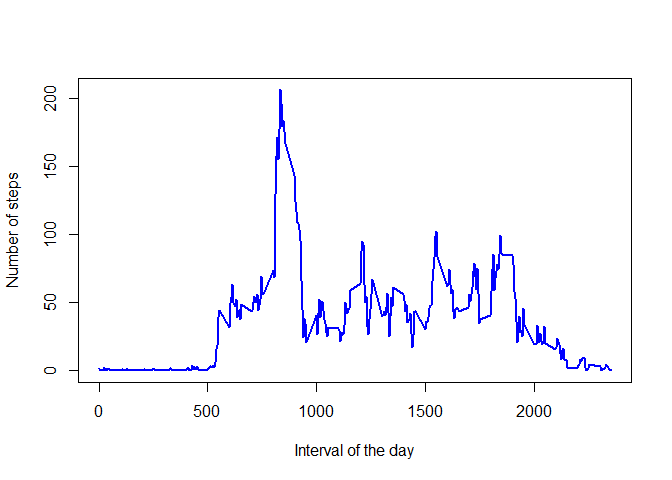

## Loading and preprocessing the data

#### Loading needed libraries and data: problem with results showing up


```r
library(lubridate)
library(dplyr)
library(ggplot2)
if (!file.exists("activity.csv")){unzip("activity.zip")}
ActMon <- read.csv("activity.csv")
```

#### Process/transform the data


```r
ActMon$date <- as.Date(ActMon$date) # transform date
```

## What is mean total number of steps taken per day?

#### Histogram of the total number of steps taken each day


```r
StepsDay <- tapply(ActMon$steps,ActMon$date,sum, na.rm = TRUE)
ggplot() + aes(StepsDay) + geom_histogram(bins = 14, colour = "black", fill = "blue") +
  xlab("Number of steps per day") + ylab("Frequency") + theme_bw()
```

<!-- -->

#### Mean and median total number of steps taken per day


```r
A <- format(round(mean(StepsDay), digits = 2), scientific = FALSE)
B <- format(round(median(StepsDay), digits = 2), scientific = FALSE)
```
The mean and median of the total number of steps taken each day are 9354.23 and 10395 respectively.

## What is the average daily activity pattern?

#### Time series plot of the 5-minute interval and the average number of steps taken, averaged across all days


```r
# Average steps per interval
StepsInt <- tapply(ActMon$steps, ActMon$interval, mean, na.rm = TRUE)
# Plot
plot(names(StepsInt), StepsInt, type = "l", col = "blue", lwd = 2, xlab = "Interval of the day", ylab = "Number of steps")
```

<!-- -->

#### Which 5-minute interval, on average across all the days in the dataset, contains the maximum number of steps?


```r
intmax <- which(StepsInt == max(StepsInt, na.rm = TRUE))
intmaxlab <- names(intmax)
```
The interval with maximum average number of steps is 835.

## Inputting missing values

#### Total number of missing values in the dataset (i.e. the total number of rows with `NA`s)


```r
missingv <- dim(ActMon)[1]-sum(complete.cases(ActMon))
# checking the interested columns
misss <- sum(is.na(ActMon$steps))
missd <- sum(is.na(ActMon$date))
missi <- sum(is.na(ActMon$interval))
```
There are 2304 rows with missing values in the dataset. A further check verifies the missing values in the columns *steps* (2304), *date* (0) and *interval* (0), showing that they are exclusively in the *steps* column.

#### Strategy for filling in all of the missing values in the dataset.


```r
ActMon2 <- ActMon
for (i in 1:dim(ActMon)[1]){
  if (is.na(ActMon[i,1])){
    ActMon2[i,1] <- StepsInt[as.character(ActMon[i,3])]
  }
}
```
Replaced missing values with the mean of steps for the relative interval.

#### New dataset with missing data filled in.

Here the head of the original dataset, showing the missing values


```r
library(knitr)
tableA <- head(ActMon)
knitr::kable(tableA,align = 'c')
```


| steps |    date    | interval |
|:-----:|:----------:|:--------:|
|  NA   | 2012-10-01 |    0     |
|  NA   | 2012-10-01 |    5     |
|  NA   | 2012-10-01 |    10    |
|  NA   | 2012-10-01 |    15    |
|  NA   | 2012-10-01 |    20    |
|  NA   | 2012-10-01 |    25    |

and the head of the new table, showing that tehy are effectively replaced.


```r
library(knitr)
tableB <- head(ActMon2)
knitr::kable(tableB,align = 'c')
```


|   steps   |    date    | interval |
|:---------:|:----------:|:--------:|
| 1.7169811 | 2012-10-01 |    0     |
| 0.3396226 | 2012-10-01 |    5     |
| 0.1320755 | 2012-10-01 |    10    |
| 0.1509434 | 2012-10-01 |    15    |
| 0.0754717 | 2012-10-01 |    20    |
| 2.0943396 | 2012-10-01 |    25    |

#### Histogram of the total number of steps taken each day and Calculate and report the **mean** and **median**.


```r
# Total number of steps per day
StepsDay2 <- tapply(ActMon2$steps,ActMon2$date,sum)
# Histogram
ggplot() + aes(StepsDay2) + geom_histogram(bins = 14, colour = "black", fill = "blue") +
  xlab("Number of steps per day") + ylab("Frequency") + theme_bw()
```

<!-- -->

```r
# mean and median of the total number of steps taken per day
C <- format(round(mean(StepsDay2), digits = 2), scientific = FALSE)
D <- format(round(median(StepsDay2), digits = 2), scientific = FALSE)
```
The new mean is 10766.19 (previous: 9354.23). The new median is 10766.19 (previous: 10395). Replacement of missing values obviously changes at least one of the estimates, since previously the intervals (or days) with NAs were simply excluded from the calculations.

## Are there differences in activity patterns between weekdays and weekends?

#### New factor variable in the dataset with two levels -- "weekday" and "weekend".


```r
ActMon2[,4] <- as.factor(weekdays(ActMon2$date))
levels(ActMon2$V4)[c(1:2,5:7)] <- "weekday"
levels(ActMon2$V4)[c(2,3)] <- "weekend"
```

#### Panel plot containing a time series plot of the 5-minute interval and the average number of steps taken, averaged across all weekday days or weekend days.


```r
# calculate average for interval across weekday or weekend days
AvgTab <- ActMon2 %>%
  group_by(V4, interval) %>%
  summarise(mean = mean(steps))
# panel plot
g <- ggplot(AvgTab,aes(interval,mean))
g + geom_line(colour = "blue", size = .8) + facet_grid(V4~.) + labs(x = "Interval", y = "Mean number of steps") +
  theme_bw()
```

<!-- -->
